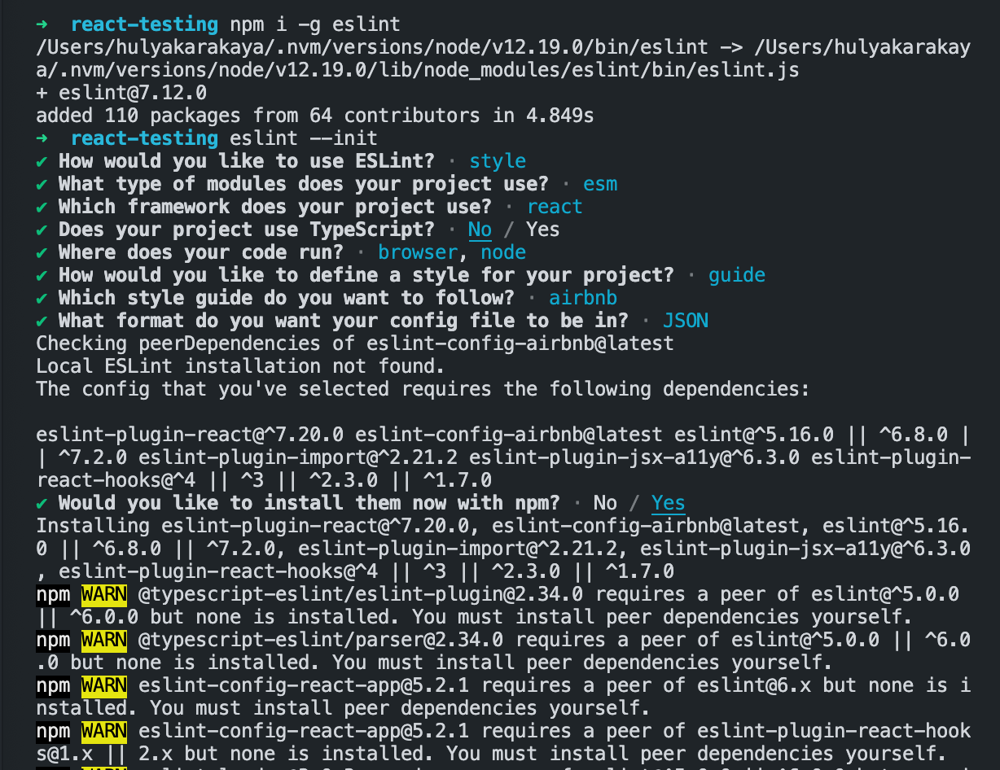
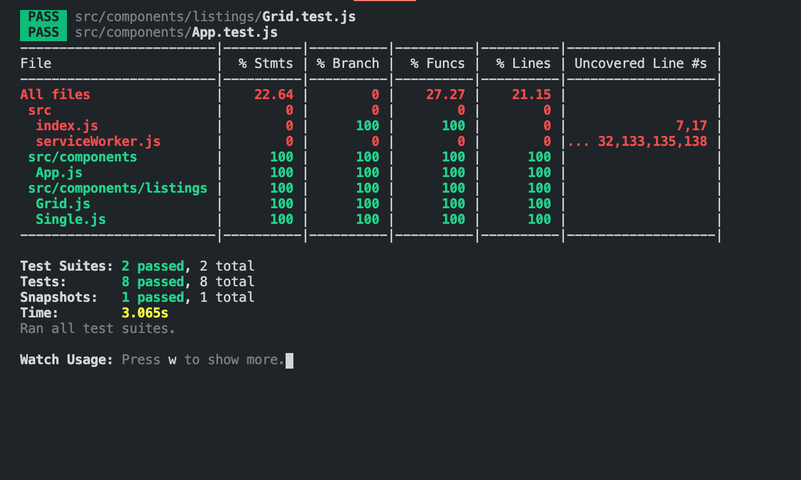

# Jest testing

## Type Checking with [Flow](https://flow.org/en/docs/install/)

`npm i flow-bin --save-dev`

add script tag in package.json `"flow": "flow"`

`npm run flow init` initialize flow, this creates `.flowconfig` file

`// @flow` it will check the files with @flow 

`npm run flow` run flow

## Linting with ESLint

Airbnb standards show warnings 

`npm i -g eslint`

`eslint --init`



`npm test`

Matchers[https://jestjs.io/docs/en/expect]

## Snapshot testing with Jest

Jest renders our component into a JSON file. And then takes a snapshot of this file. Then whenever we run our test, Jest compares the snapshot with the latest rendered output. If there is any difference between them, we get notified. 

`npm i react-test-renderer`

`import renderer from 'react-test-renderer';`

```javascript
test('App snapshot test', () => {
	const component = renderer.create(<App />);  // UI
	const tree = component.toJSON(); // render this to JSON.
	expect(tree).toMatchSnapshot();
});
```

type `u` to update the tests


## Organize your tests with describe()

## Coverage Report

`"coverage": "npm run test -- --coverage",` => package.json new script

`npm run coverage` to see the report of your tests

